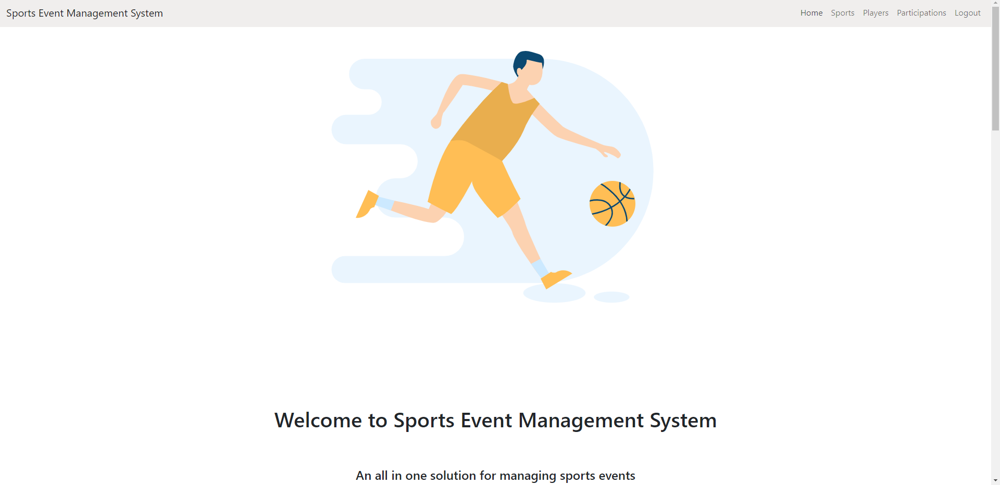
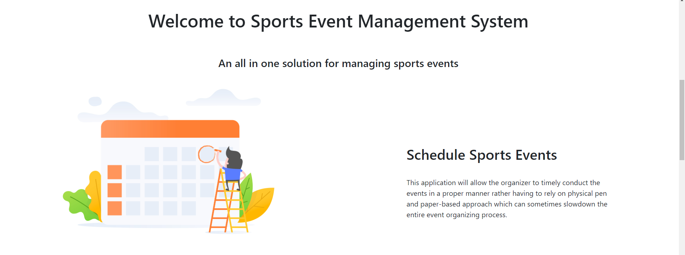
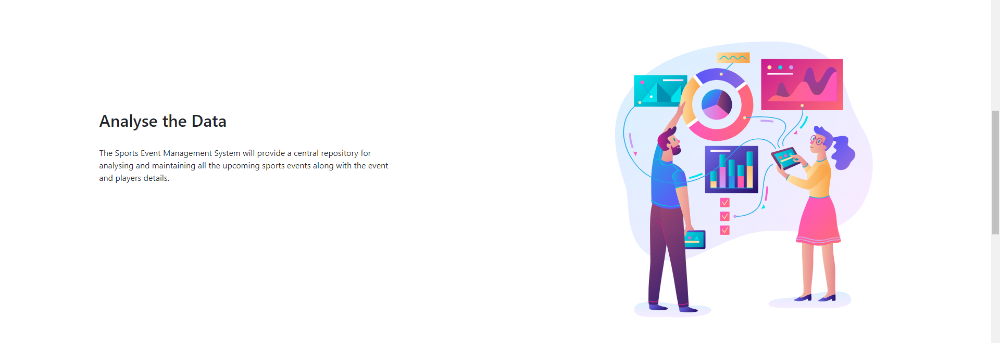
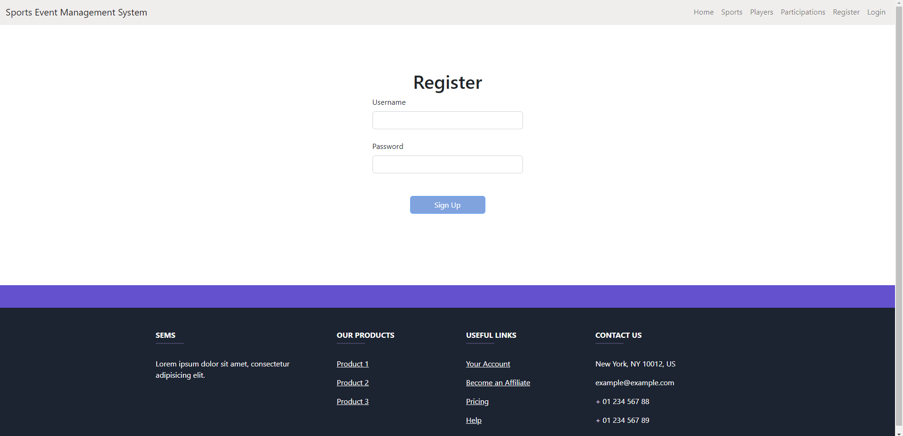
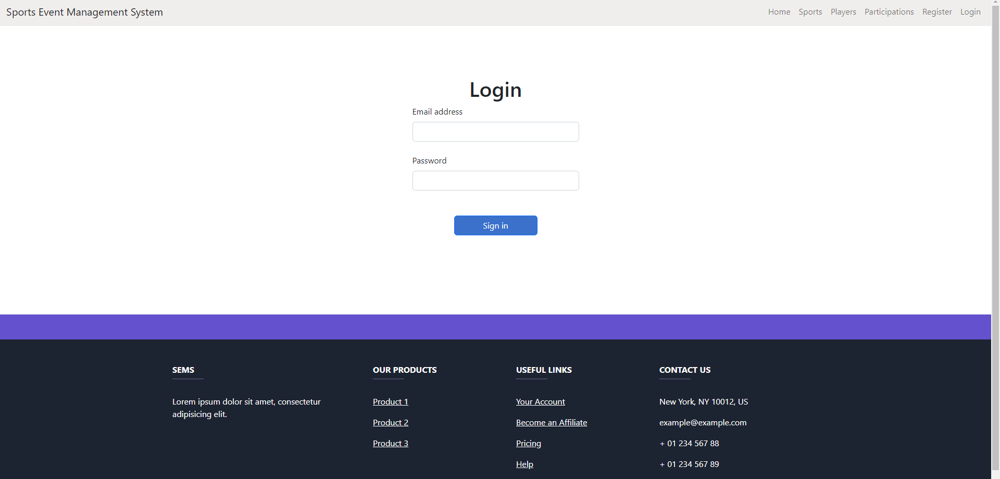
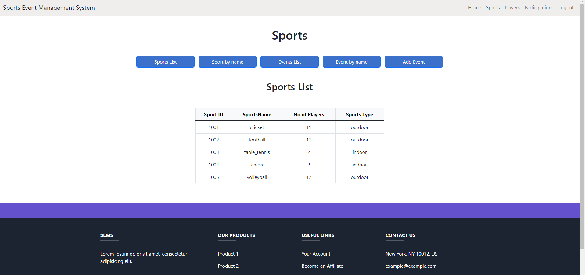
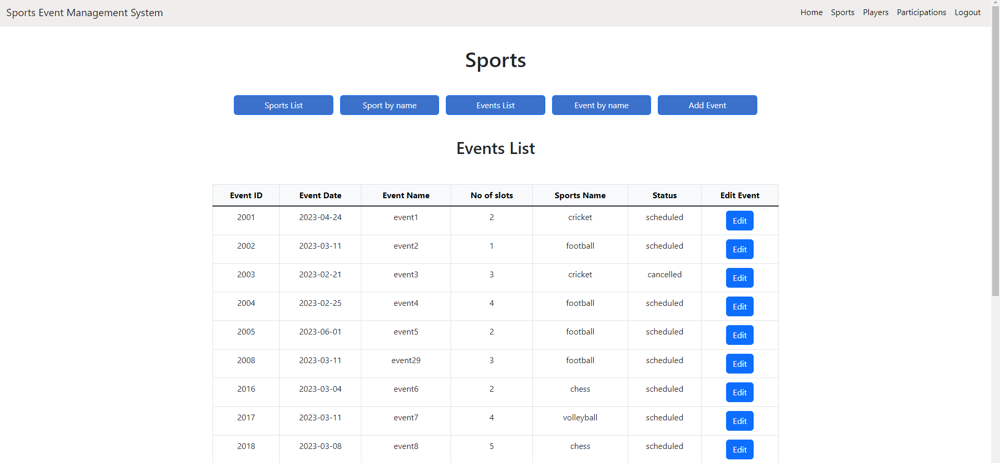
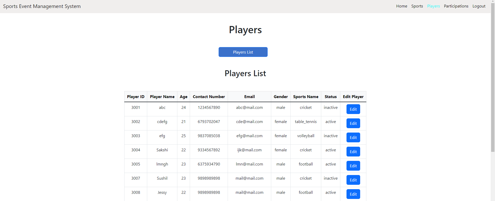
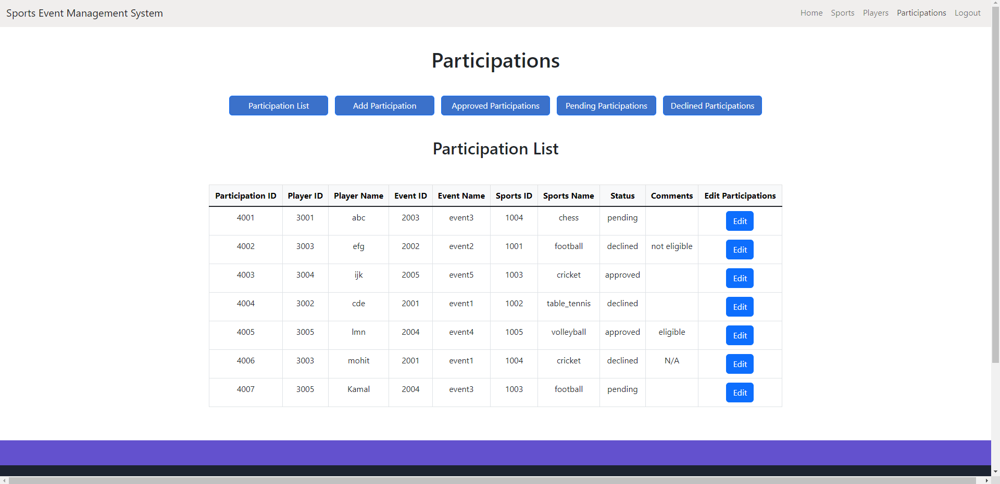

# Sports Event Management System

The Sports Event Management System (SEMS) is a full stack application written in Angular 15 and ASP.NET Core 7.0 Web APIs to manage the activity of all the sports events at one place.

Some of its characteristics are :

1. Centralized Data

The Sports Event Management System will provide a central repository for accessing
and maintaining all the upcoming sports events along with the event and players
details.

2. Timely Management

This application will allow the organizer to timely conduct the events in a proper
manner rather having to rely on physical pen and paper-based approach which can
sometimes slowdown the entire event organizing process.

3. Archive of past events

It will also provide its user and admin the facility to browse through the past sports
events which happened on a specific date along with several other details such as the
number of teams and the players which participated in that event.

4. Manage Participation Requests

The user can raise a request to participate in a sports event and the admin can approve
or deny the participant request based on his own requirements and can also write
comments in case the participation request is denied.

## Micro Service Architecture

This application is developed using multiple microservices (Login,Register,etc) so that failure of one microservice does not affect the functionality of the entire application.

## Services

The services which this application provides are:

1. [Register Service](https://github.com/mohitnagpalhsr/registerApi)
2. [Login Service](https://github.com/mohitnagpalhsr/loginApi)
3. [Sports Service](https://github.com/mohitnagpalhsr/sportsnsApi)
4. [Players Service](https://github.com/mohitnagpalhsr/playersApi)
5. [Participation Service](https://github.com/mohitnagpalhsr/participationsApi)

## Screenshots

Home Page

Register Page

Login Page

Sports Page

Events Page

Players Page

Participations Page

